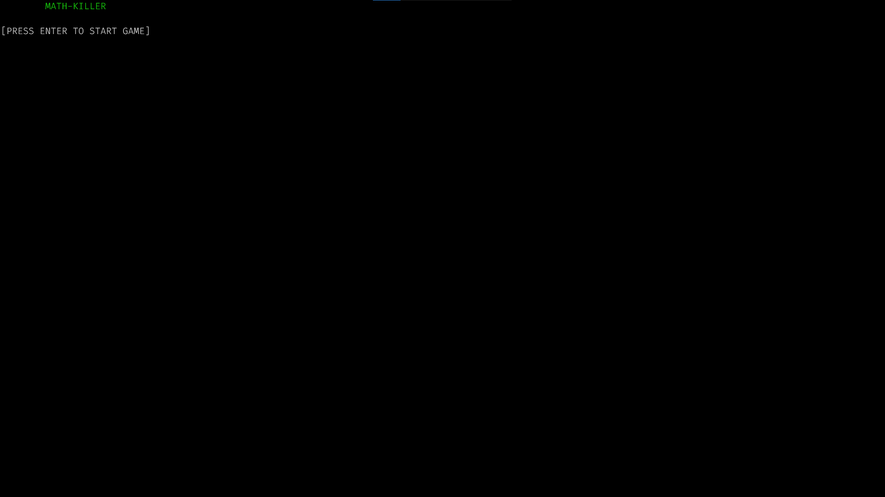
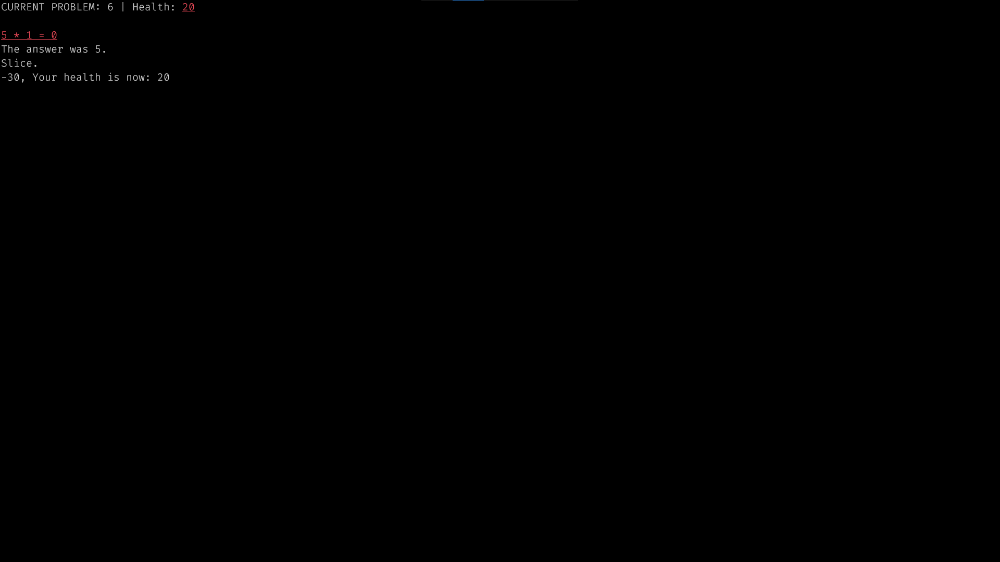
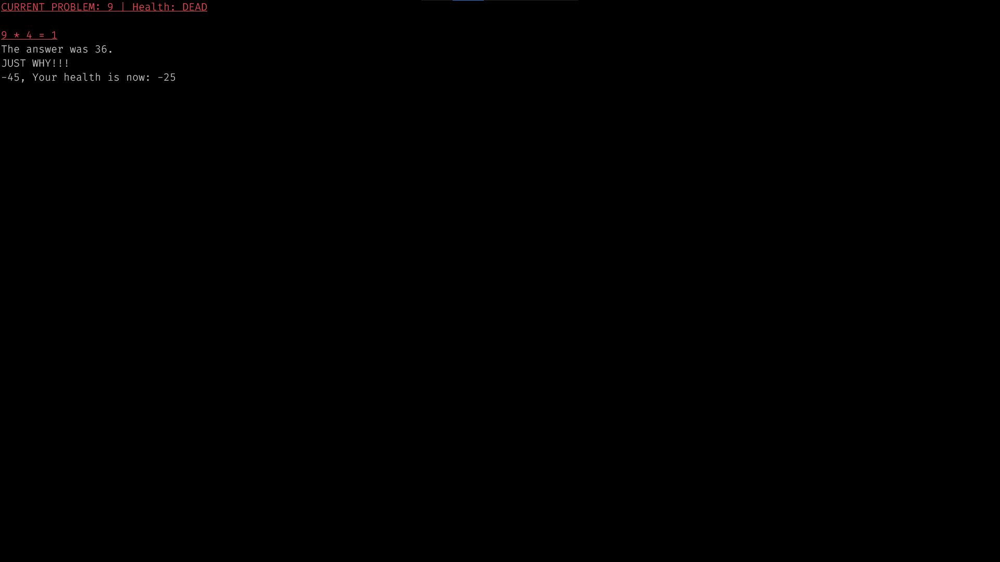
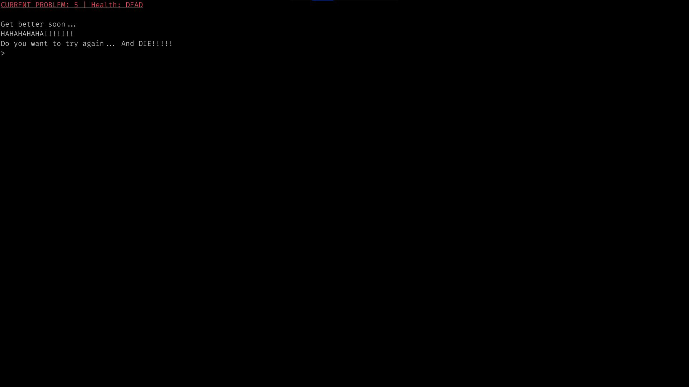
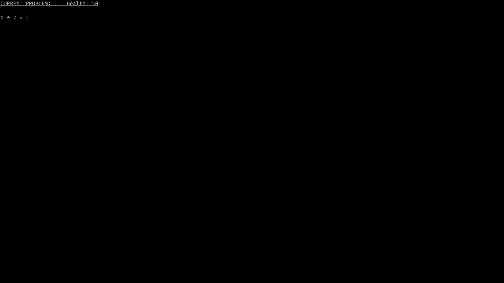

# math-killer-windows
 A math game for windows.

 This math game features multiplication and gets progressively harder.

 At some point, it will become impossible to do the math.

 The game features a teacher that is cruel and taunts you if you get anything wrong.

 This game requires python 3.6 and above.

 This version of the game for windows does have sound.

 ---
 Installation
 ---
 Method One:
 Download the zip file from the top of the page and then unpack it in your home directory.

 Method Two:
 Run these commands in powershell.
 ```bash
 cd ~
 git clone "https://github.com/hudsonsmith/math-killer-windows.git"
 ```
 
 Then run it with python3.
 ```bash
 cd .\math-killer-windows\
 python main.py
 ```

 Enjoy!

 ---
 Screenshots:
 ---
 
 

 
 

 
